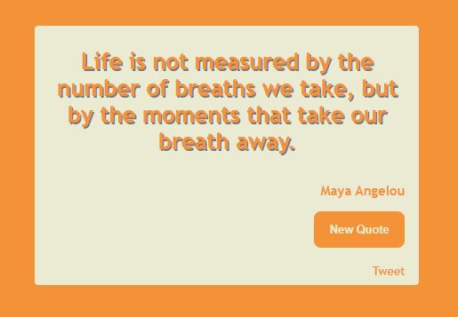

# Quote Machine
 
This is the first challenge on the FreeCodeCamp Front End Development Libraries course.

## Table of contents

- [Overview](#overview)
  - [The challenge](#the-challenge)
  - [Screenshot](#screenshot)
  - [Links](#links)
- [My process](#my-process)
  - [Built with](#built-with)
- [Author](#author)

## Overview

### The challenge

Users should be able to:

- See a new quote and author on opening the app
- Be able to click a button to get a new quoute and author
- Be able to click a link to open Twitter and create a new post

- Extra that I added was the color change on every button click for a new quote.

### Screenshot

### Links

- Solution URL: [https://github.com/BiancaNiemann/Quote_Machine](https://github.com/BiancaNiemann/Quote_Machine)
- Live Site URL: [https://biancaniemann.github.io/Quote_Machine/](https://biancaniemann.github.io/Quote_Machine/)

## My process

### Built with

- Semantic HTML5 markup
- CSS custom properties
- Javascript

## Author

- Website - [Bianca Niemann](https://portfolio-seven-sepia-13.vercel.app/)
- Frontend Mentor - [@BiancaNiemann](https://www.frontendmentor.io/profile/BiancaNiemann)
- LinkedIn - [@BiancaNiemann](https://www.linkedin.com/in/bianca-niemann-8671b1246/)